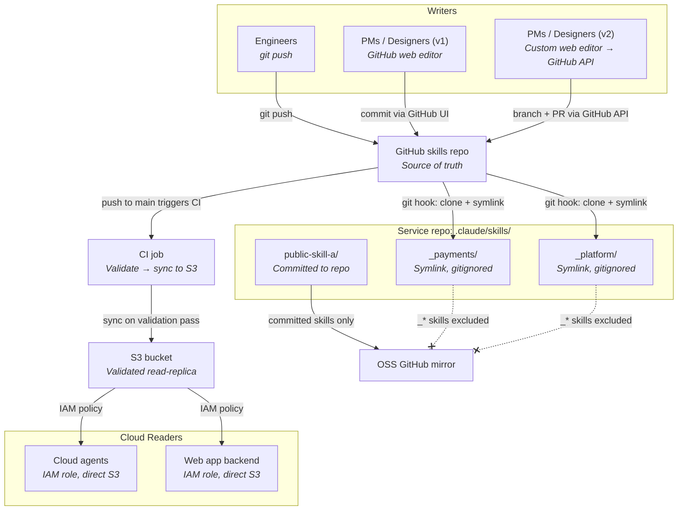

# Product Requirements Document: Scaffold

## Overview

Scaffold is an open-source platform for managing AI context artifacts — PRDs, ADRs, tech plans, design docs — across an engineering organization. It provides a standard format and tooling that makes these artifacts accessible to both humans and AI agents, without ever committing them to source repositories.

The primary use case is a large organization where designers, engineers, and product managers are adopting AI into the SDLC and need a shared, agent-native home for context documents.

Three audiences access skills through distinct paths: **engineers** clone the GitHub skills repository and get skills automatically symlinked into their repos via a bash git hook — no additional tooling or auth required; **non-technical contributors** (PMs, designers) edit via the GitHub web editor (v1) or a purpose-built web editor (v2); and **cloud agents** read directly from S3 using IAM-authenticated access.

No proprietary tooling is required for any path.



---

## Problem Statement

As AI agents become first-class participants in the SDLC, context artifacts (PRDs, ADRs, tech plans) need to be:

- **Agent-readable** without polluting agent context with irrelevant content
- **Human-editable** without requiring engineering skills or a PR workflow
- **Never committed** to project source repositories, especially open-source ones
- **Easy to update and share** across teams and tools

No existing solution satisfies all four constraints simultaneously.

---

## Goals

- Provide a standard, agent-native artifact format organizations can adopt
- Make artifact management accessible to non-technical contributors via a web editor
- Give engineers a zero-setup, git-native workflow requiring no additional tooling or auth
- Distribute skills into service repositories automatically via a bash git hook
- Be fully self-hostable by any organization with minimal infrastructure effort
- Be free and open source; commercial hosted offering may follow later

## Backwards Compatibility

This PRD represents a deliberate redesign of Scaffold. There is no backwards compatibility requirement with prior versions. Implementors should proceed without concern for existing behavior, data formats, or interfaces.

---

## Non-Goals

- Agent activation / skill invocation mechanics (handled by the agent framework)
- IdP configuration (operated externally; scaffold consumes it)
- Change notifications or real-time collaboration (users implement their own; e.g., a session-start hook)
- Versioning UI / rollback UX (S3 versioning is enabled from day one as a safety net; user-facing rollback is deferred)
- Per-project access control (all authenticated users can read and write all skills for now)
- Merge conflict resolution (last-write-wins for S3; git handles conflicts in the skills repo per normal git semantics)
- A proprietary CLI — distribution is intentionally handled by standard git tooling
- Rich media attachments (audio, video) — non-engineers will want to attach recordings and walkthroughs as context. Deferred to a later phase. Likely implementation: upload binary assets to a separate S3 prefix, commit a reference (URL or key) into the skill's `references/` directory rather than committing the binary to git.

---

## Users & Personas

| Persona | Primary Surface | Key Need |
|---|---|---|
| Engineer | GitHub skills repo + bash git hook | Zero-setup skill distribution; edit and publish via standard git |
| PM / Designer (v1) | GitHub web editor | Edit skills without CLI knowledge |
| PM / Designer (v2) | Custom web editor | Richer browse/create/edit UX |
| Cloud Agent | S3 direct (IAM) | Read skills at runtime without human interaction |
| Platform / DevOps | Terraform + GitHub Actions | Self-host and maintain the infrastructure |

---

## Terminology

| Term | Definition |
|---|---|
| **Project** | The user-facing concept. One project = one set of related context artifacts. |
| **Skill** | The underlying implementation format for a project. Not exposed in user-facing surfaces. |
| `platform` skill | A special skill containing cross-cutting ADRs and org-wide standards shared across projects. |
| **Skills git repo** | A dedicated, internal-only git repository that is the source of truth for all skill artifacts. Never mirrored to public open-source repositories. All writes (engineer git pushes, web editor commits) target this repo. CI validates every push to main and syncs the result to S3. |
| **Committed skills** | Skills checked directly into a service repo's `.claude/skills/` directory. These are public, mirrored to open source, and managed by the service team. |
| **Synced skills** | Skills distributed from S3 (the validated read-replica). These are internal-only, symlinked into `.claude/skills/` with a `_` prefix, and gitignored in the service repo. |
| **Default skill** | A skill marked `metadata.default: true` in its `SKILL.md` frontmatter. Symlinked into every service repo automatically, regardless of what is declared in `scaffold.json`. Represents agent infrastructure knowledge that all repos need. |
| `contribute-to-skills` skill | The canonical default skill. Teaches agents how to contribute changes back to the skills repo. Present in every repo without any configuration. |
| **Utility skill** | A skill with `"category": "utility"` in its `plugin.json`. Provides agent infrastructure knowledge (e.g., how to use Scaffold itself) rather than domain-specific project context. |
| **Plugin marketplace** | The skills git repo is structured as a Claude Code plugin marketplace. The `marketplace.json` at the repo root lists every project as an installable plugin. |
| **Plugin** | Each project/skill is wrapped as a Claude Code plugin. The plugin contains the skill in its `skills/` directory and is described by a `plugin.json` manifest. |

---

## Artifact Format

### Agent Skills

All artifacts follow the Agent Skills format (`agentskills.io`). Skills are **not archived or zipped** — they are stored and transferred as individual files. The format provides progressive disclosure:

- Only `name` + `description` (~100 tokens) load at agent startup
- Full `SKILL.md` body loads only when the skill is activated
- Reference files load on demand

### One Skill Per Project

Each project is a single skill, wrapped in a Claude Code plugin. Individual artifact types live as reference files within the skill:

```
plugins/payments/                         # Plugin root
├── .claude-plugin/
│   └── plugin.json                       # Plugin manifest
└── skills/
    └── payments/                         # Skill root
        ├── SKILL.md                      # Executive summary: what is this, key decisions, status
        ├── references/
        │   ├── prd.md
        │   ├── tech-plan.md
        │   └── adrs/
        │       ├── payment-processor-selection.md
        │       └── retry-strategy.md
        └── assets/
            └── architecture-diagram.png
```

`SKILL.md` is a lean orientation doc. Detailed content lives in `references/`. Individual ADR files (not a single `adrs.md`) keep context granular so agents only load what they need.

### The Platform Skill

Cross-cutting standards and org-wide ADRs live in a dedicated `platform` plugin with `"category": "platform"` in its `plugin.json`. To include it in a service repo, add `"platform"` to the `skills` array in `scaffold.json` (see [Git Hook: Engineer Setup](#git-hook-engineer-setup)).

### `SKILL.md` Frontmatter

`SKILL.md` contains only what is needed for agent progressive disclosure. All rich metadata lives in `plugin.json`.

```yaml
---
description: >
  Context for the payments platform. Use when working on payment processing,
  billing, or any integration with payment providers.
---
```

| Field | Required | Description |
|---|---|---|
| `description` | Yes | One or two sentences loaded at agent startup — make it agent-useful. |

### `plugin.json` Schema

```json
{
  "name": "payments",
  "description": "Context for the payments platform. Use when working on payment processing, billing, or any integration with payment providers.",
  "version": "1.0.0",
  "category": "project",
  "status": "active",
  "keywords": ["payments", "billing", "fintech"],
  "scope": ["repo-payments", "repo-billing"],
  "default": false
}
```

| Field | Required | Description |
|---|---|---|
| `name` | Yes | Skill name. Must match `[a-z0-9][a-z0-9-]*`. Must equal the plugin directory name. |
| `description` | Yes | Used in `_index.json` and marketplace listings. |
| `version` | Yes | Semantic version string. |
| `category` | Yes | `project` \| `platform` \| `utility` |
| `status` | No | Default `active`. |
| `keywords` | No | Array of strings. Mirrored as S3 object tags on `SKILL.md` at CI sync time. |
| `scope` | No | Array of repo names this skill is relevant to. |
| `default` | No | Boolean. If `true`, symlinked into every repo regardless of `scaffold.json`. Omit when false. |

### Skill Naming Rules

- Characters: alphanumeric, spaces allowed in input (normalized to hyphens)
- Stored as: lowercase, leading/trailing whitespace stripped, spaces replaced with hyphens (e.g., `my-payments-platform`)
- Display: the UI may render names as Title Case
- Unique within the organization's skills repo

---

## Source of Truth: GitHub Skills Repository

The skills git repo is the source of truth for all skill artifacts. It is a dedicated, internal-only repository — never mirrored to public GitHub. All writes target this repo; S3 is populated exclusively from it via CI.

**The repo is structured as a Claude Code plugin marketplace.** Each project is a plugin in `plugins/`, and the root `marketplace.json` lists them all. Engineers install skills via `/plugin install payments@company-skills` using their existing Claude Code install — no bash hook or additional tooling required.

### Repo Layout

```
agent-skills/
  .claude-plugin/
    marketplace.json                  # Marketplace catalog — lists all plugins
  plugins/
    platform/
      .claude-plugin/
        plugin.json
      skills/
        platform/
          SKILL.md
          references/
            ...
    payments/
      .claude-plugin/
        plugin.json
      skills/
        payments/
          SKILL.md
          references/
            prd.md
            tech-plan.md
            adrs/
              payment-processor-selection.md
```

The `marketplace.json` enumerates every project as an installable plugin using relative paths:

```json
{
  "name": "company-skills",
  "owner": { "name": "Your Org" },
  "plugins": [
    {
      "name": "payments",
      "source": "./plugins/payments",
      "description": "Context for the payments platform..."
    },
    {
      "name": "platform",
      "source": "./plugins/platform",
      "description": "Cross-cutting org-wide standards and ADRs"
    }
  ]
}
```

The S3 bucket layout reflects the extracted skill structure (not the plugin wrapper), so cloud agents see the flat `<skill-name>/SKILL.md` hierarchy unchanged. CI extracts skills from `plugins/<name>/skills/<name>/` before syncing to S3.

### CI: Validate and Sync

Every push to `main` triggers a CI job that:

1. Validates `marketplace.json` and each `plugin.json`: required fields (`name`, `description`, `version`, `category`), `category` must be `project | platform | utility`, `name` must match `[a-z0-9][a-z0-9-]*` and equal the plugin directory name
2. Validates each `SKILL.md`: frontmatter parseable, `description` field present, no individual file over 1 MB
3. Runs secret and PII scanning (GitHub Advanced Security or equivalent)
4. On pass: extracts skills from `plugins/<name>/skills/<name>/`, syncs the extracted tree to S3 (`s3 sync --delete` semantics), and rebuilds `_index.json` from scratch
5. On fail: CI check fails, the push is flagged, S3 is untouched

Because S3 is only written after CI passes, it is always clean. No quarantine, no staging prefix, no post-write remediation.

**Propagation latency:** CI typically completes in 1–3 minutes. For context documents (PRDs, ADRs, tech plans) this delay is acceptable.

### Engineer Contribution Flow

Engineers work directly in the skills git repo:

1. Clone `agent-skills` once
2. Create or edit a plugin directory under `plugins/`; update `marketplace.json` if adding a new plugin
3. `git commit -am "Update payments context" && git push`
4. CI validates and syncs to S3 within 1–3 minutes

No AWS credentials, no proprietary binary.

### Engineer Installation Flow

Engineers add the skills marketplace once and install whichever projects they need:

```
/plugin marketplace add git@github.com:your-org/agent-skills.git
/plugin install payments@company-skills
/plugin install platform@company-skills
```

Skills are installed into `.claude/skills/` as symlinks with the `_` prefix (gitignored). The bash git hook remains supported as an alternative for repos that cannot adopt the plugin marketplace flow.

---

## Storage: S3

S3 is a validated read-replica. It is populated exclusively by the CI job that runs on every push to the main branch of the skills git repo. Nothing writes to S3 directly — not engineers, not the web editor. This means S3 is always in a clean, validated state.

### Design Decisions

| Decision | Rationale |
|---|---|
| S3 as read-replica, not SOT | GitHub is the SOT; S3 is optimized for fast, low-latency reads by cloud agents and the web app. See [ADR-001](#adr-001-github-as-source-of-truth-s3-as-validated-read-replica). |
| Individual files, not archives | Each file within a skill is a separate S3 object (`payments/SKILL.md`, `payments/references/prd.md`, etc.). No zipping or packaging step. Keeps storage transparent, enables partial downloads, and makes versioning meaningful at the file level. |
| S3 versioning enabled | Safety net for accidental CI overwrites; rollback UX is deferred but the data is preserved. |
| CI is the only write path | Validation runs in CI before any S3 write. No governance logic needed in a proxy Lambda. |
| Sync replaces the full skill folder | Each CI sync mirrors the entire skill directory to S3 and removes any objects no longer present in git (`s3 sync --delete` semantics). |

### S3 Object Tags

`SKILL.md` is the canonical object for a skill and carries two S3 object tags set at CI sync time:

| Tag key | Source | Example value |
|---|---|---|
| `Description` | `description` field from `plugin.json` | `"Context for the payments platform..."` |
| `Tags` | `keywords` array from `plugin.json` (joined with commas) | `"payments,billing,fintech"` |

These tags enable lightweight filtering and discovery directly in S3 (e.g., via `aws s3api get-object-tagging`) without needing to download and parse every `SKILL.md`.

### Bucket Layout

```
s3://<bucket>/
  platform/
    SKILL.md
    references/
      ...
  payments/
    SKILL.md
    references/
      prd.md
      tech-plan.md
      adrs/
        payment-processor-selection.md
  billing/
    SKILL.md
    ...
```

---

## Tag-Based Skill Discovery

Skills are discoverable by tag via a bucket-level manifest file, `_index.json`, stored at the root of the S3 bucket. The manifest is the read surface for all list and filter operations; it is rebuilt by CI on every successful sync.

### Manifest Format

`s3://<bucket>/_index.json`

```json
{
  "version": 1,
  "updated_at": "<ISO 8601 timestamp>",
  "skills": [
    {
      "name": "<skill-name>",
      "description": "<description text>",
      "type": "project | platform | utility",
      "default": true,
      "status": "active",
      "tags": ["<tag>", "..."],
      "scope": ["<repo-name>", "..."],
      "updated_at": "<ISO 8601 timestamp>"
    }
  ]
}
```

The `tags` field is the `keywords` array from `plugin.json`, already a JSON array — no normalization step required. The `default` field is omitted when false. `_index.json` is a reserved key; the `[a-z0-9][a-z0-9-]*` skill name validation rule prevents any skill from conflicting with it.

### Design Decisions

| Decision | Rationale |
|---|---|
| S3 manifest, not DynamoDB | No new AWS services; self-hosting stays minimal; one GET serves any list or filter operation. DynamoDB is appropriate if scale reaches thousands of skills or multi-writer contention becomes measurable — neither condition exists today. |
| Rebuilt from scratch by CI | Guarantees manifest is always consistent with actual bucket state. No partial updates, no missed entries. |
| JSON array for tags | Read directly from `plugin.json`'s `keywords` array — no normalization step required. Makes client-side filtering trivial. |
| Per-skill `updated_at` | Allows browse UIs to sort by recency without fetching individual objects. |

### Write Path

`_index.json` is written exclusively by the CI job. After syncing all skill objects to S3, CI rebuilds the manifest from scratch by reading every `plugin.json` in the `plugins/` directory. If the manifest write fails, CI retries. The manifest is eventually consistent with S3 on every successful CI run.

### Read Path

The web app fetches `_index.json` on browse view load and performs all filtering — by tag, type, status, name substring — client-side with no additional API calls.

Cloud agents fetch `_index.json` via `GetObject` for discovery before fetching individual skill files.

---

## Git Hook: Engineer Setup

The git hook is the distribution mechanism for engineers. It requires only `git`, `python3`, and standard POSIX tools — no AWS credentials, no proprietary binary, no additional auth.

### What It Does

On `post-merge` (i.e., after `git pull`) in a service repo:

1. Clones or updates `~/.agent-skills/` from the GitHub skills repo
2. Reads `scaffold.json` in the service repo root to determine which skills to link; if absent, links all available skills
3. Symlinks each selected skill into `.claude/skills/_<name>/`
4. Scans all `SKILL.md` files in the local clone for `metadata.default: true`; symlinks any default skill not already linked
5. Adds `.claude/skills/_*/` to `.git/info/exclude` so synced skills are never accidentally committed

### scaffold.json

`scaffold.json` lives in the service repo root and declares which skills to symlink. If the file is absent, all skills are linked.

```json
{
  "skills": ["platform", "payments", "billing"]
}
```

### Default Skills

Default skills are symlinked into every service repo automatically, independent of `scaffold.json`. A skill is designated as a default by its author in the skills repo via `metadata.default: true` in its `SKILL.md` frontmatter — not in per-repo or org-level config. This keeps the skills repo as the single source of truth.

The hook processes defaults in a second pass after the explicit `skills` list. A skill present in both is only linked once — the `ln -sfn` call is idempotent.

### The Script

```bash
#!/usr/bin/env bash

SKILLS_REPO="${SCAFFOLD_SKILLS_REPO:-git@github.com:your-org/agent-skills.git}"
SKILLS_DIR="$HOME/.agent-skills"
SCAFFOLD_CONFIG="scaffold.json"

echo "[scaffold] Updating skills..."

if [ ! -d "$SKILLS_DIR/.git" ]; then
  if ! git clone "$SKILLS_REPO" "$SKILLS_DIR" 2>&1; then
    echo "[scaffold] ERROR: Failed to clone skills repo ($SKILLS_REPO). Skills not updated." >&2
    exit 0
  fi
else
  if ! git -C "$SKILLS_DIR" pull --rebase --quiet origin main 2>&1; then
    echo "[scaffold] WARNING: Failed to pull latest skills. Using cached version." >&2
  fi
fi

mkdir -p .claude/skills

link_skill() {
  local name="$1"
  local skill_dir="$SKILLS_DIR/$name"
  if [ ! -d "$skill_dir" ]; then
    echo "[scaffold] WARNING: Skill '$name' not found in skills repo — skipping." >&2
    return
  fi
  if ln -sfn "$skill_dir" ".claude/skills/_${name}" 2>/dev/null; then
    echo "[scaffold] Linked: $name"
  else
    echo "[scaffold] ERROR: Failed to link skill '$name'." >&2
  fi
}

if [ -f "$SCAFFOLD_CONFIG" ]; then
  skills=$(python3 -c "
import json, sys
try:
    d = json.load(open('$SCAFFOLD_CONFIG'))
    print('\n'.join(d.get('skills', [])))
except Exception as e:
    print(f'parse error: {e}', file=sys.stderr)
    sys.exit(1)
" 2>/dev/null)
  if [ $? -ne 0 ] || [ -z "$skills" ]; then
    echo "[scaffold] WARNING: Could not parse $SCAFFOLD_CONFIG — linking all skills." >&2
    skills=""
  fi
fi

if [ -z "$skills" ]; then
  for skill_dir in "$SKILLS_DIR"/*/; do
    [ -d "$skill_dir" ] || continue
    link_skill "$(basename "$skill_dir")"
  done
else
  while IFS= read -r name; do
    [ -n "$name" ] && link_skill "$name"
  done <<< "$skills"
fi

grep -qxF '.claude/skills/_*/' .git/info/exclude 2>/dev/null \
  || echo '.claude/skills/_*/' >> .git/info/exclude

echo "[scaffold] Done."
```

The script never uses `set -e` — every error is logged and the script exits cleanly (`exit 0`) so it never interrupts the engineer's `git pull` workflow.

The skills repo URL is read from `~/.scaffold/settings.json`, which org tooling sets during developer onboarding.

### Installation

**Node.js projects** — add to `package.json`:

```json
{
  "scripts": {
    "postinstall": "cp .hooks/post-merge .git/hooks/post-merge && chmod +x .git/hooks/post-merge"
  }
}
```

**Other projects** — install via `Makefile` target, bootstrap script, or Husky.

Engineers clone the repo, run their normal setup step (`npm install`, `make setup`, etc.), and skills are immediately available in `.claude/skills/`. No additional steps.

### Prefix Convention

Synced skills use a `_` prefix to distinguish them from committed (public) skills:

| Skill type | Example path | Tracked in git | Mirrored to OSS |
|---|---|---|---|
| Committed | `.claude/skills/public-skill-a/` | Yes | Yes |
| Synced | `.claude/skills/_payments/` | No (gitignored) | No |

The service repo's `.gitignore` excludes all synced skills:

```
.claude/skills/_*/
```

---

## The `contribute-to-skills` Skill

`contribute-to-skills` is the canonical default skill — it is `metadata.default: true` and will be present in every service repo automatically. Its purpose is to give agents the mental model they need to contribute changes back to the organization's skills repo.

Without this skill, an agent working in a service repo has no way to know that:

- The skills repo lives at `~/.scaffold/agent-skills/` on the engineer's machine
- The `.claude/skills/_*/` entries are symlinks pointing into that local clone, not standalone directories
- The correct write path for skill changes is editing files inside `~/.scaffold/agent-skills/`, then committing and pushing to the skills repo
- Changes propagate to S3 (and therefore to all other repos on the next `git pull`) via CI within 1–3 minutes

Without this context, an agent may attempt to modify the symlinked path (changes work locally but are lost on the next `git pull` sync) or attempt to commit symlink contents into the service repo (blocked by `.git/info/exclude`). The skill prevents both failure modes.

### Directory Layout

```
plugins/contribute-to-skills/
├── .claude-plugin/
│   └── plugin.json
└── skills/
    └── contribute-to-skills/
        ├── SKILL.md
        └── references/
            └── workflow.md
```

`SKILL.md` is the lean orientation doc. `references/workflow.md` contains the step-by-step contributing guide so agents load it only when they need it.

### `plugin.json`

```json
{
  "name": "contribute-to-skills",
  "description": "Instructions for contributing changes back to the agent-skills repository. Activate when you need to create, update, or push a skill — including adding context for the current project — to the organization's skills repo.",
  "version": "1.0.0",
  "category": "utility",
  "default": true,
  "status": "active",
  "keywords": ["scaffold", "contributing", "meta"]
}
```

### `SKILL.md` frontmatter

```yaml
---
description: >
  Instructions for contributing changes back to the agent-skills repository.
  Activate when you need to create, update, or push a skill — including adding
  context for the current project — to the organization's skills repo.
---
```

---

## Web Editor

### v1: GitHub Web Editor

For v1, non-technical contributors are given direct access to the skills GitHub repository and edit using GitHub's built-in markdown editor. No custom web application is built.

**Write flow:**
1. PM opens the file in GitHub (e.g., `payments/SKILL.md`)
2. Edits in the GitHub editor and commits directly to `main`
3. CI validates the commit and syncs to S3 within 1–3 minutes
4. If CI fails (schema error, secret detected), the GitHub check turns red and S3 is untouched

**Tradeoffs accepted in v1:**
- PMs see raw YAML frontmatter — mitigated with a clear template and frontmatter comments in `SKILL.md`
- GitHub access provisioning is a manual process (or handled by org IAM tooling)
- No custom browse or filter UI — PMs navigate the repo directory structure

v1 establishes real usage patterns before investing in a custom UI. A custom web editor (v2) is motivated by observed PM friction, not assumed in advance.

---

### v2: Custom Web Editor

A purpose-built web application. Built after v1 surfaces specific friction points.

#### Authentication

SAML — integrates with the organization's existing identity provider (Okta, Azure AD, etc.).

#### Write Flow

All writes go through the GitHub skills repo, not directly to S3:

1. User edits in the web editor (client-side state, not yet saved)
2. User clicks **Save**
3. Web editor creates a branch (`save/<uuid>`), commits the changes, and opens a PR with auto-merge enabled via the GitHub API (using a GitHub App credential — the user never sees GitHub)
4. UI immediately shows the updated content with a **"Publishing..."** indicator (optimistic update)
5. Web editor polls the PR status every ~15 seconds
6. CI validates the commit; on pass, auto-merge fires and the PR merges to `main`; CI syncs to S3
7. UI flips the indicator to **"Live"** (or removes it)
8. On CI failure: UI reverts the optimistic state, shows the failure reason, offers **"Edit and retry"**

**Auto-merge prerequisite:** The skills repo must have branch protection on `main` with required CI status checks configured. This is handled by the `github` Terraform module.

**Branch strategy:** One branch per save (`save/<uuid>`). GitHub's "automatically delete head branches" setting cleans them up after merge. A periodic cleanup job removes stale `save/*` branches if CI fails and PRs are abandoned.

#### S3 Read Path

The web app backend reads from S3 directly using its server-side IAM role — no proxy Lambda required. It fetches `_index.json` for browse/list views and individual `SKILL.md` / reference files for edit views.

#### Features

**Browse**
- List all skills with filter by name (substring match)
- Filter controls for `type` (project / platform)

**Edit**
- Edit any file within a skill (`SKILL.md` or any reference file) in a markdown editor
- Client-side staging: changes accumulate until the user explicitly saves
- Save triggers the GitHub commit + PR flow described above

**Create (new skill wizard)**
1. Enter project name (validated and normalized per naming rules; error shown if name already exists)
2. `plugin.json` pre-filled with name, description, version, and category; `SKILL.md` pre-filled with description frontmatter
3. Optionally add reference files (PRD, tech plan, ADRs)
4. Save → creates the full plugin directory structure via a GitHub commit and registers it in `marketplace.json`

**Utility actions**
- **"Copy as Markdown"** button on every file — copies raw markdown to clipboard for pasting into any AI tool
- **"Download for Agent"** button on every skill — produces a formatted context bundle for the skill as a single downloadable file

---

## Cloud Agent Access

Cloud-hosted AI agents read skills directly from S3 — no proxy, no VPN requirement.

### Authentication

Cloud agents authenticate via an IAM role or instance profile attached to the compute environment (ECS task, Lambda function, EC2 instance, etc.). The `iam` Terraform module provisions a read-only role for this purpose and is available from day one.

### Access Pattern

Agents interact with S3 directly using the AWS SDK:

- **Discovery**: `GetObject` on `_index.json` to find available skills and filter by tag, type, or status
- **Skill load**: `GetObject` on `<name>/SKILL.md` for the executive summary and frontmatter
- **Reference files**: `GetObject` on `<name>/references/<file>` on demand, following the progressive disclosure model of the Agent Skills format

The read-only IAM policy grants `s3:GetObject` and `s3:ListBucket` on the bucket; write operations are denied.

### Design Decisions

| Decision | Rationale |
|---|---|
| Direct S3, not a proxy | Cloud agents are non-interactive; IAM roles are the standard AWS mechanism for machine-to-machine auth. No custom proxy adds latency and operational surface area with no benefit. |
| Read-only policy | Agents consume context; they do not author it. |
| No VPN requirement | Cloud agents run in infrastructure environments (ECS, Lambda) that may not route through the corporate VPN. IAM policy is the enforcement boundary. |

---

## Infrastructure & Self-Hosting

Self-hosting is a first-class goal. Any organization should be able to run this stack with minimal effort.

### Terraform Modules

| Module | Resources |
|---|---|
| `s3` | Private bucket, versioning enabled, bucket policy |
| `iam` | Read-only role (cloud agents + web app); CI write role (GitHub Actions → S3) |
| `github` | Skills repo (structured as a plugin marketplace), branch protection on `main`, required CI status checks, auto-merge enabled, auto-delete head branches |
| `web` | Web editor deployment (ECS or k8s) — v2 only |

Modules are independently deployable so organizations can adopt incrementally (e.g., `s3` + `iam` + `github` first, `web` later).

### Helm Chart (Kubernetes)

For organizations running k8s instead of ECS (v2 web editor only):

- Standard `Deployment`, `Service`, `Ingress`
- `ConfigMap` for environment-specific config (bucket name, SAML IdP URL, GitHub App credentials, etc.)
- `Secret` references compatible with External Secrets Operator
- Sane resource requests/limits defaults
- Horizontal pod autoscaling included
- Works against any standard k8s distribution (EKS, GKE, AKS, self-managed)

### Self-Hosting Checklist

A self-hoster needs to provide:

1. S3-compatible bucket (AWS S3, MinIO, or any compatible store)
2. IAM roles or equivalent (read-only for agents/web app; write for CI)
3. A git host (GitHub, GitLab, Gitea, etc.) for the skills repo
4. A CI system (GitHub Actions, GitLab CI, Jenkins, etc.) for the validate-and-sync job
5. A container runtime (ECS, k8s, or equivalent) — only if deploying the v2 web editor

### Licensing

MIT license. Self-hosting is free for any organization. A hosted SaaS offering may be offered commercially in the future; self-hosted use is and will remain free.

---

## Auth Summary

| Surface | Mechanism |
|---|---|
| Web editor v1 | GitHub credentials (direct repo access) |
| Web editor v2 | SAML (custom app); GitHub App token for API writes |
| Engineer git access | Existing GitHub credentials |
| Git hook | No auth — reads from the already-authed local clone of the skills repo |
| Cloud agent S3 reads | IAM role / instance profile (read-only policy) |
| Web app S3 reads | IAM role attached to web app compute (read-only policy) |
| CI S3 writes | IAM role attached to GitHub Actions runner |

---

## Build Sequence

| Phase | Deliverable | Unlocks |
|---|---|---|
| 1 | GitHub skills repo + branch protection + CI skeleton | SOT established; engineers can push skills via git from day one |
| 2 | CI: validate + sync to S3 + rebuild `_index.json` | S3 always clean; cloud agent access available immediately |
| 3 | Plugin marketplace structure (`marketplace.json` + per-plugin `plugin.json`) + bash git hook fallback | Engineers install via `/plugin install`; hook covers environments without Claude Code |
| 4 | Skill template (starter plugin directory with `plugin.json` + `SKILL.md`) | Engineers can create new skills without a wizard |
| 5 | v1 web editor: GitHub repo access for PMs + `plugin.json` / `SKILL.md` template/comments | Non-engineer on-ramp with zero custom UI work |
| 6 | v2 web editor: browse + edit SPA (SAML, GitHub API write path, optimistic UI) | Purpose-built PM/designer experience |
| 7 | v2 web editor: new skill wizard | Full no-code skill authoring |

---

## Architecture Decision Records

### ADR-001: GitHub as Source of Truth, S3 as Validated Read-Replica

**Status:** Accepted

**Context:**

Two storage models were evaluated:

- **S3-as-SOT:** All writes go directly to S3 via a proxy Lambda. Git is a downstream distribution layer, synced nightly from S3.
- **GitHub-as-SOT:** All writes go to a GitHub skills repository. CI validates every push and syncs to S3. S3 is a read-only cache.

The initial design used S3-as-SOT. The governance concern that prompted reconsideration: with S3-as-SOT, content is live the moment it is written. To enforce validation before publication, you need either synchronous Lambda validation (fast checks only — schema, naming) or async scanning with quarantine-after-write (PII/secrets detection runs after the object is already accessible). The async quarantine model means content may be readable by cloud agents for minutes before it is flagged and removed. Addressing this with S3-as-SOT requires building a staging prefix, a state machine, and a notification pipeline — effectively reimplementing CI inside S3.

**Decision:**

Use GitHub as the source of truth. S3 is a validated read-replica, written only by CI after validation passes.

**Reasons:**

1. **Governance is solved by CI, not custom infrastructure.** GitHub Actions runs validation (schema, naming, secret scanning via GitHub Advanced Security) before any S3 write. S3 is always clean. No quarantine, no staging prefix, no post-write remediation.

2. **No bespoke validation pipeline.** The S3-as-SOT model requires a proxy Lambda, async scanning jobs, quarantine logic, and notifications. GitHub Actions provides all of this off the shelf.

3. **Audit trail is first-class.** Git history, PR diffs, and commit attribution are native to GitHub. The S3-as-SOT model had to reconstruct this through a nightly sync job.

4. **Engineer write path is already git.** Engineers already push to git repos. `git push` to the skills repo requires no new mental model.

5. **Web editor write path is manageable.** The v1 web editor uses GitHub's built-in editor directly. The v2 custom editor calls the GitHub API to create a commit + PR with auto-merge — the GitHub plumbing is invisible to the user.

**Reasons S3-as-SOT was rejected:**

1. **Quarantine-after-write is a weak guarantee.** Async scanning means content is live before it is validated. Cloud agents may read unscanned content.

2. **Lambda validation cannot run slow checks.** Schema validation is fast; secret scanning and PII detection are not. Blocking the Lambda on slow checks degrades the write experience. Async checks reintroduce the quarantine problem.

3. **S3 is not a natural write surface.** The proxy Lambda, custom authorizer, and VPN enforcement are infrastructure that exists only to mediate writes. With GitHub as SOT, this collapses to standard git credentials + GitHub Actions.

**Consequences:**

- **Propagation latency:** A save does not appear in S3 until CI passes (typically 1–3 minutes). For context documents (PRDs, ADRs, tech plans) this is acceptable.
- **GitHub dependency:** Self-hosting requires a GitHub instance (or equivalent: GitLab, Gitea). This is already required for the engineer distribution path, so it is not a new dependency.
- **Binary assets:** Large assets (`assets/` in a skill) are committed to git. Git LFS may be needed for very large files. This is a known limitation; rich media attachments (audio, video) are a deferred non-goal.

---

### ADR-002: No Proprietary CLI

**Status:** Accepted

**Context:**

The initial design included a Rust CLI (`scaffold`) for pull, link, push, and skill creation operations. As the architecture evolved — GitHub becoming the SOT, S3 becoming a read-replica — the CLI's responsibilities narrowed to: (1) pulling files from S3 and (2) creating symlinks in `.claude/skills/`. Both operations are trivial bash.

**Decision:**

Retire the Rust CLI. Replace it with a bash git hook (distribution) and standard git commands (publishing). Skill creation uses a template directory that engineers copy.

**Reasons:**

1. **Bash covers the distribution use case completely.** Cloning a git repo and creating symlinks is ~15 lines of POSIX shell. No compiled binary is needed.

2. **Engineers already know git.** `git push` to the skills repo is the entire publish workflow. No new commands to learn.

3. **Cloud agents use AWS SDK directly.** Agents read S3 via `GetObject` — a CLI intermediary adds latency and a binary dependency with no benefit.

4. **The web editor handles non-engineers.** PMs and designers never needed a CLI; the web editor is their surface.

5. **A compiled binary creates distribution friction.** Installing, updating, and maintaining a platform-specific binary across an engineering org contradicts Scaffold's own low-friction goal. A bash script checked into the repo is always at the right version.

**Consequences:**

- Skill creation requires manually copying a template directory (or using the web editor wizard in v2). There is no `scaffold new` wizard for engineers.
- Power users who want scaffolding helpers can build their own thin wrappers around the bash hook without any coordination.
- The existing Rust codebase (`src/`, `lambda/`) is no longer the implementation path. It can be archived.
